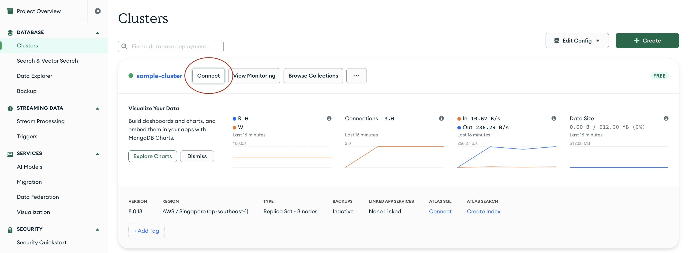

# User Service Guide

## Setting-up

> 📝 Note: If you are familiar with MongoDB and wish to use a local instance, please feel free to do so via the **[MongoDB Community Edition](https://www.mongodb.com/docs/manual/administration/install-community/)**. This guide utilizes MongoDB Cloud Services.
>
> ⚠️ Important Network Notice: MongoDB Atlas connections are blocked on the NUS network. If you are using MongoDB Atlas, you must disconnect from the NUS network (including NUS Wi-Fi or nVPN) and connect using an alternative network such as phone hotspot. Otherwise, your application will fail to connect to the database even if your connection string is correct.

1. Set up a MongoDB Cluster by following the steps in this **[guide](./MongoDBSetup.md)**.

    > 💡 If the project maintainer has already set up a shared MongoDB cluster, you can skip this step. Ask the maintainer for the connection string and database credentials instead, then jump straight to **step 7**.

2. Set up Firebase Admin for backend authentication/authorization by following this **[guide](./FirebaseSetup.md)**.

3. After setting up, go to the **[Clusters](https://cloud.mongodb.com/go?l=https%3A%2F%2Fcloud.mongodb.com%2Fv2%2F%3Cproject%3E%23%2Fclusters)**  Page. You would see a list of the clusters you have set up. Select `Connect` on the cluster you just created earlier on for User Service.

    

4. Select the `Drivers` option, as we have to link to a Node.js App (User Service).

    

5. Select `Node.js` in the **Driver** dropdown menu.
6. Copy the connection string.

    > Note, you may see `<password>` in this connection string. We will be replacing this with the admin account password that we created earlier on when setting up the Cluster.

    

7. In the `user-service` directory, create a `.env` file.

8. Add the following variables to `.env`:

  ```env
  # Required: selects which DB URI the service uses
  ENV=development

  # Required when ENV=development
  DB_LOCAL_URI=mongodb://127.0.0.1:27017/peerprepUserServiceDB

  # Required when ENV=PROD
  DB_CLOUD_URI=mongodb+srv://<db_username>:<db_password>@<cluster-host>/<db-name>?retryWrites=true&w=majority

  # Optional (defaults to 3001 in docker-compose)
  PORT=3001

  # Optional when config/service_key.json exists in the project.
  # If you prefer env-based credentials, set this to a compact single-line JSON string.
  FIREBASE_SERVICE_KEY=
  ```

9. If you are using `DB_CLOUD_URI`, replace `<db_username>` and `<db_password>` with your actual credentials.

10. If your MongoDB password contains special characters, URL-encode them (for example `@` becomes `%40`).

## Running User Service

> 📝 Note: Ensure you have **[Node.js (LTS)](https://nodejs.org/en/download)** installed. At the time of writing, the latest LTS version is `v24.13.0`. Select your operating system, package manager, and Node.js version from the dropdowns at the top of the [page]((https://nodejs.org/en/download)), then follow the provided instructions.
>
> ⚠️ Minimum Version Requirement: Use Node.js `v20.10.0` or newer. This project uses the `with { type: "json" }` import attributes syntax in `config/firebase.js`, which is not supported in older Node.js versions.

1. Open Command Line/Terminal and navigate into the `user-service` directory.

    ```sh
    cd user-service
    ```

2. Install all the necessary dependencies by running the command:

    ```sh
    npm install
    ```

3. Start the User Service in production mode by running:

    ```sh
    npm start
    ```

    Alternatively, you can start it up in development mode (which includes features like automatic server restart when you make code changes) by running:

    ```sh
    npm run dev
    ```

4. Using applications like Postman, you can interact with the User Service on port `3001`. If you wish to change this, please update `PORT` in the `.env` file.

## Running With Docker Compose

1. Open Terminal and go to the `user-service` folder.

  ```sh
  cd services/user-service
  ```

2. Ensure your `.env` file exists and includes the fields listed in the setup section.

3. Build and start the container:

  ```sh
  docker compose up --build
  ```

4. Stop and remove the container when done:

  ```sh
  docker compose down
  ```

5. Service endpoint after startup:
   - `http://localhost:3001`

### Required `.env` Fields (Compose)

Use this quick checklist before running `docker compose up --build`:

- Required: `ENV`
- Required when `ENV=development`: `DB_LOCAL_URI`
- Required when `ENV=PROD`: `DB_CLOUD_URI`
- Optional: `PORT` (defaults to `3001`)
- Optional: `FIREBASE_SERVICE_KEY` (not required if `config/service_key.json` is present in the container)

Example:

```env
ENV=development
DB_LOCAL_URI=mongodb://127.0.0.1:27017/peerprepUserServiceDB
DB_CLOUD_URI=
PORT=3001
FIREBASE_SERVICE_KEY=
```

### Docker Compose Environment Rules

- `ENV=development` uses `DB_LOCAL_URI`.
- `ENV=PROD` uses `DB_CLOUD_URI`.
- If the selected URI is missing, the service will fail at MongoDB connection startup.
- The service currently uses `ENV` for DB selection logic (not `NODE_ENV`).

## User Service API Guide

This service currently uses Firebase ID tokens for authentication. It does not issue local JWTs.

For protected routes, include:

`Authorization: Bearer <FIREBASE_ID_TOKEN>`

### Register User Profile

- Purpose: Create a user profile in MongoDB using an already-authenticated Firebase user.
- HTTP Method: `POST`
- Endpoint: <http://localhost:3001/auth/register>
- Headers
  - Required: `Authorization: Bearer <FIREBASE_ID_TOKEN>`
- Body
  - Optional: `username` (string), `name` (string)

    ```json
    {
      "username": "sampleUser"
    }
    ```

- Behavior:
  - If user does not exist in MongoDB: creates user with role `user`, returns `201`.
  - If user already exists: returns existing user, `200`.
  - On first registration, Firebase custom claim `role: "user"` is set.

- Responses:

    | Response Code               | Explanation                                  |
    |-----------------------------|----------------------------------------------|
    | 201 (Created)               | User registered in MongoDB                   |
    | 200 (OK)                    | User already registered                      |
    | 401 (Unauthorized)          | Missing/invalid Firebase ID token            |
    | 500 (Internal Server Error) | Firebase/database/server error               |

### Update User Privilege

You need an admin token to use this endpoint.

- Purpose: Update role in MongoDB and sync Firebase custom claim.
- Safety rule: Admin users cannot be demoted to `user`.
- HTTP Method: `PATCH`
- Endpoint: <http://localhost:3001/users/{userId}/privilege>
- Parameters
  - Required: `userId` (MongoDB Object ID)
- Headers
  - Required: `Authorization: Bearer <FIREBASE_ID_TOKEN>`
  - Auth Rule: Admin users only
- Body
  - Required: `role` (string)
  - Allowed values: `"admin"`, `"user"`

  > Note: Setting role to `"user"` for a target that is currently an admin will be rejected.

    ```json
    {
      "role": "admin"
    }
    ```

- Responses:

    | Response Code               | Explanation                                  |
    |-----------------------------|----------------------------------------------|
    | 200 (OK)                    | Role updated in MongoDB and Firebase claim   |
    | 400 (Bad Request)           | Missing/invalid role or attempted admin demotion |
    | 401 (Unauthorized)          | Missing/invalid Firebase ID token            |
    | 403 (Forbidden)             | Caller is not admin                          |
    | 404 (Not Found)             | User not found                               |
    | 500 (Internal Server Error) | Database/server error                        |

### Get User

- This endpoint allows retrieval of a single user's data from the database using the user's ID.

  > 💡 The user ID refers to the MongoDB Object ID, a unique identifier automatically generated by MongoDB for each document in a collection.

- HTTP Method: `GET`

- Endpoint: <http://localhost:3001/users/{userId}>

- Parameters
  - Required: `userId` path parameter
  - Example: `http://localhost:3001/users/60c72b2f9b1d4c3a2e5f8b4c`

- Headers

  - Required: `Authorization: Bearer <FIREBASE_ID_TOKEN>`

  - Explanation: This endpoint requires a Firebase ID token in the request header for authentication and authorization. The server verifies this token with Firebase Admin SDK.

  - Auth Rules:

    - Admin users: Can retrieve any user's data. The server verifies the user associated with the Firebase token is an admin user and allows access to the requested user's data.

    - Non-admin users: Can only retrieve their own data. The server checks if the user ID in the request URL matches the ID of the user associated with the Firebase token. If it matches, the server returns the user's own data.

- Responses:

    | Response Code               | Explanation                                              |
    |-----------------------------|----------------------------------------------------------|
    | 200 (OK)                    | Success, user data returned                              |
    | 401 (Unauthorized)          | Access denied due to missing/invalid/expired token       |
    | 403 (Forbidden)             | Access denied for non-admin users accessing others' data |
    | 404 (Not Found)             | User with the specified ID not found                     |
    | 500 (Internal Server Error) | Database or server error                                 |

### Get All Users

- This endpoint allows retrieval of all users' data from the database.
- HTTP Method: `GET`
- Endpoint: <http://localhost:3001/users>
- Headers
  - Required: `Authorization: Bearer <FIREBASE_ID_TOKEN>`
  - Auth Rules:

    - Admin users: Can retrieve all users' data. The server verifies the user associated with the Firebase token is an admin user and allows access to all users' data.

    - Non-admin users: Not allowed access.

- Responses:

    | Response Code               | Explanation                                      |
    |-----------------------------|--------------------------------------------------|
    | 200 (OK)                    | Success, all user data returned                  |
    | 401 (Unauthorized)          | Access denied due to missing/invalid/expired token |
    | 403 (Forbidden)             | Access denied for non-admin users                |
    | 500 (Internal Server Error) | Database or server error                         |

### Update User

- This endpoint allows updating a user and their related data in the database using the user's ID.

- HTTP Method: `PATCH`

- Endpoint: <http://localhost:3001/users/{userId}>

- Parameters
  - Required: `userId` path parameter

- Body
  - Required: `username` (string)

    ```json
    {
      "username": "SampleUserName"
    }
    ```

- Headers
  - Required: `Authorization: Bearer <FIREBASE_ID_TOKEN>`
  - Auth Rules:

    - Admin users: Can update any user's data. The server verifies the user associated with the Firebase token is an admin user and allows the update of requested user's data.

    - Non-admin users: Can only update their own data. The server checks if the user ID in the request URL matches the ID of the user associated with the Firebase token. If it matches, the server updates the user's own data.

- Responses:

    | Response Code               | Explanation                                             |
    |-----------------------------|---------------------------------------------------------|
    | 200 (OK)                    | User updated successfully, updated user data returned   |
    | 400 (Bad Request)           | Missing username or duplicate username                  |
    | 401 (Unauthorized)          | Access denied due to missing/invalid/expired token      |
    | 403 (Forbidden)             | Access denied for non-admin users updating others' data |
    | 404 (Not Found)             | User with the specified ID not found                    |
    | 500 (Internal Server Error) | Database or server error                                |

### Delete User

- This endpoint allows deletion of a user and their related data from the database using the user's ID.
- Safety rule: The final remaining admin account cannot be deleted.
- HTTP Method: `DELETE`
- Endpoint: <http://localhost:3001/users/{userId}>
- Parameters

  - Required: `userId` path parameter
- Headers

  - Required: `Authorization: Bearer <FIREBASE_ID_TOKEN>`

  - Auth Rules:

    - Admin users: Can delete any user's data. The server verifies the user associated with the Firebase token is an admin user and allows the deletion of requested user's data.

    - Non-admin users: Can only delete their own data. The server checks if the user ID in the request URL matches the ID of the user associated with the Firebase token. If it matches, the server deletes the user's own data.
- Responses:

    | Response Code               | Explanation                                             |
    |-----------------------------|---------------------------------------------------------|
    | 200 (OK)                    | User deleted successfully                               |
    | 400 (Bad Request)           | Cannot delete the last admin                            |
    | 401 (Unauthorized)          | Access denied due to missing/invalid/expired token      |
    | 403 (Forbidden)             | Access denied for non-admin users deleting others' data |
    | 404 (Not Found)             | User with the specified ID not found                    |
    | 500 (Internal Server Error) | Database or server error                                |
